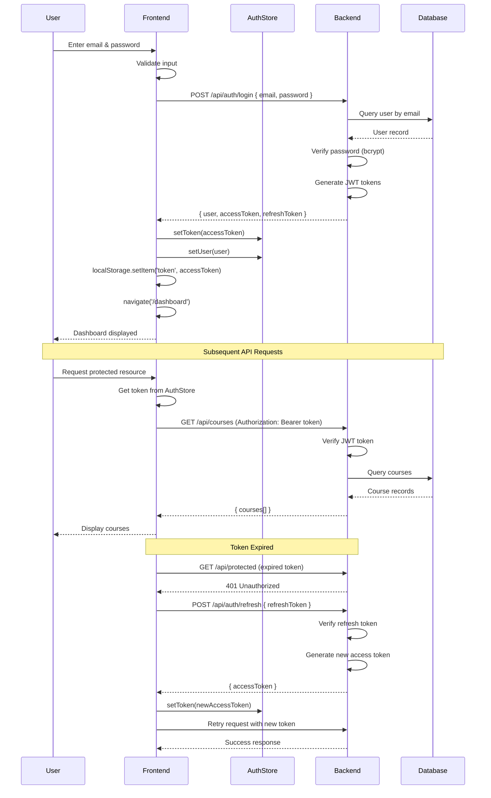
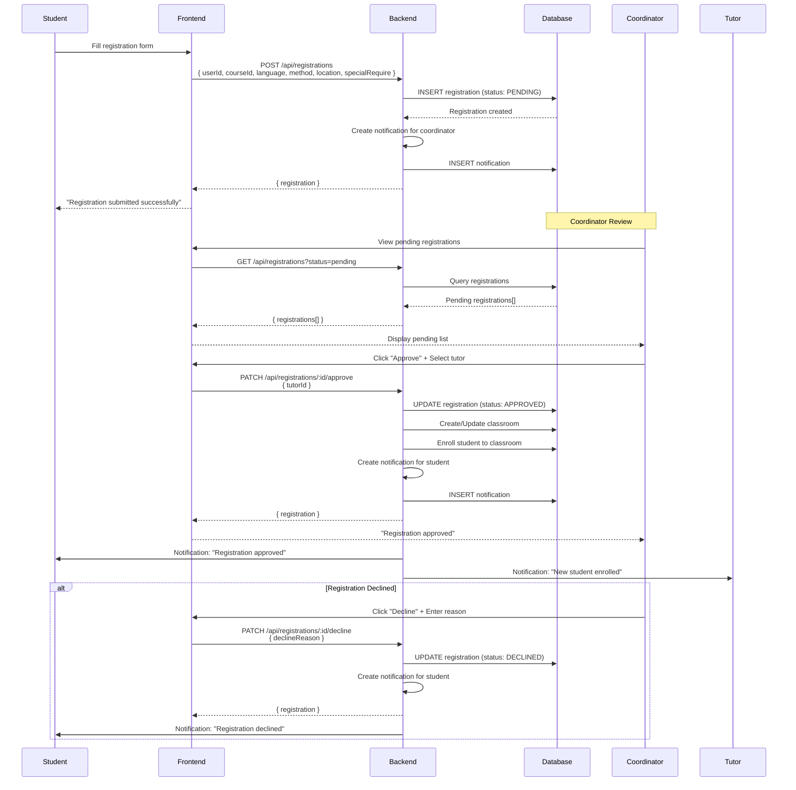
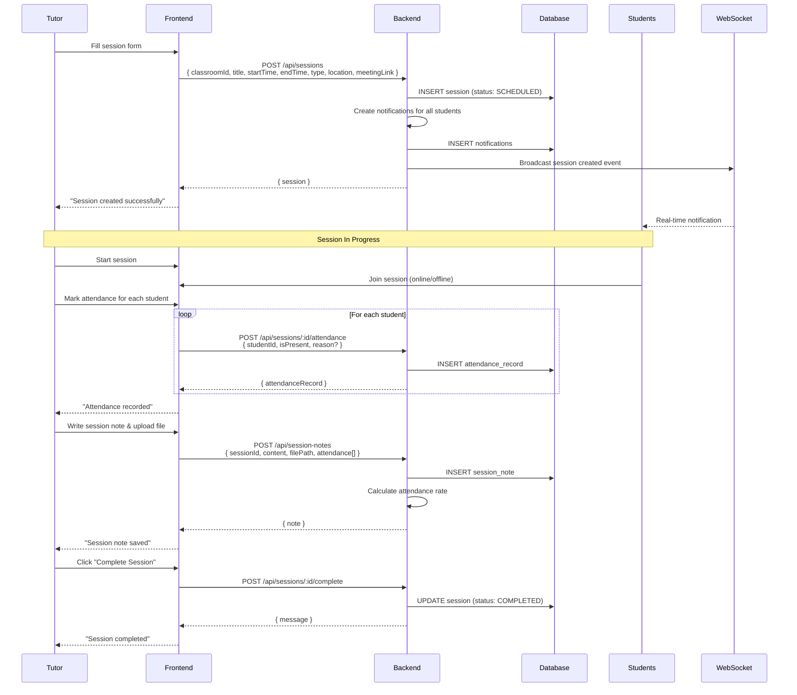
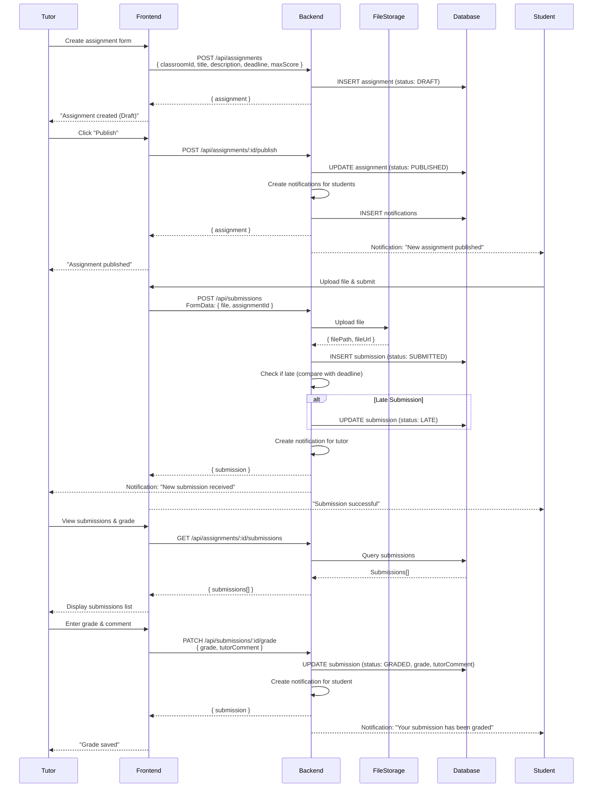
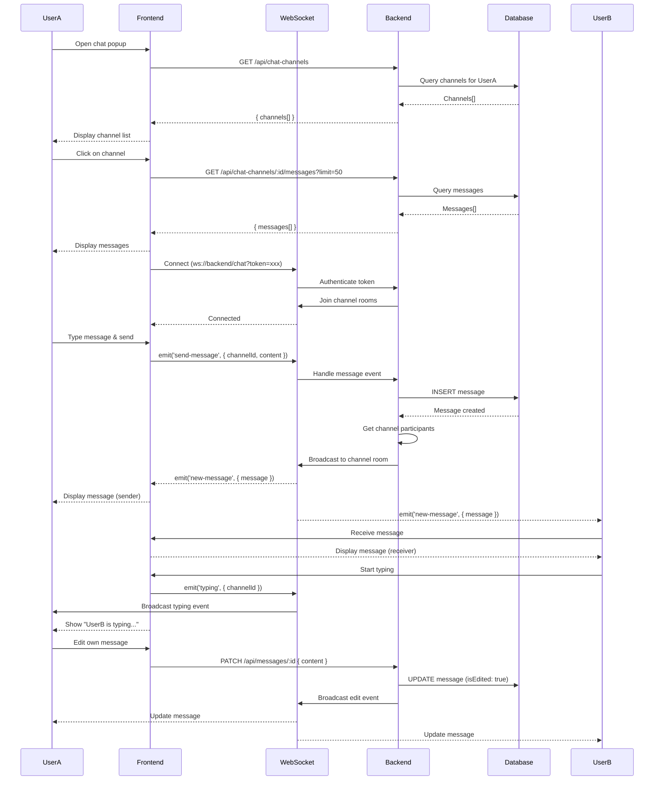
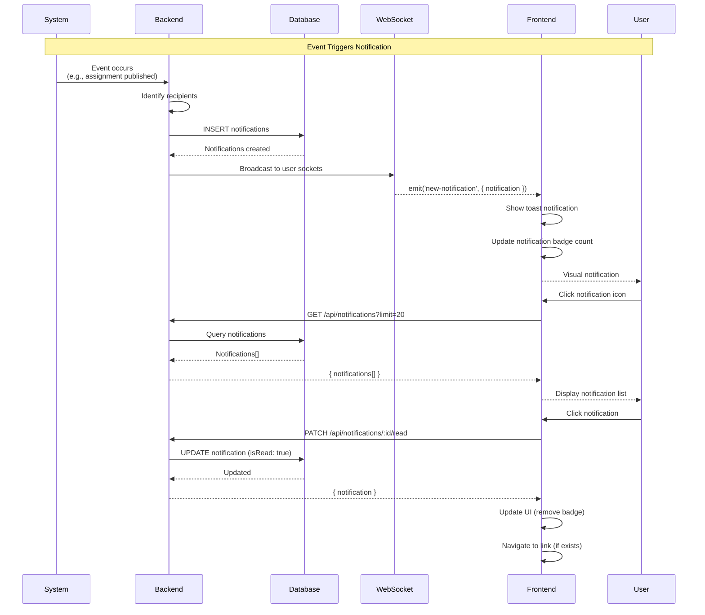
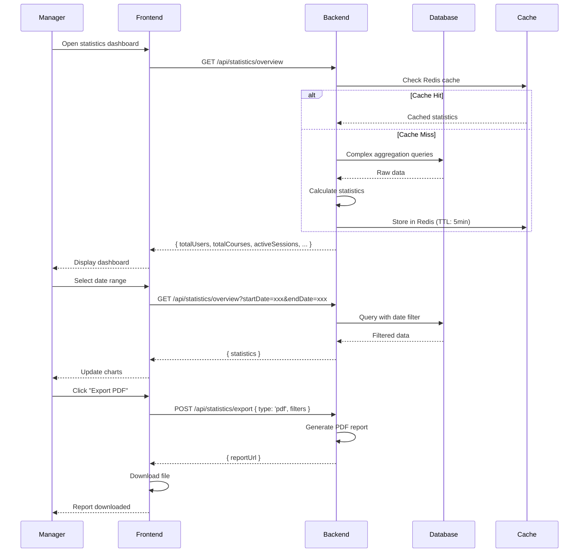
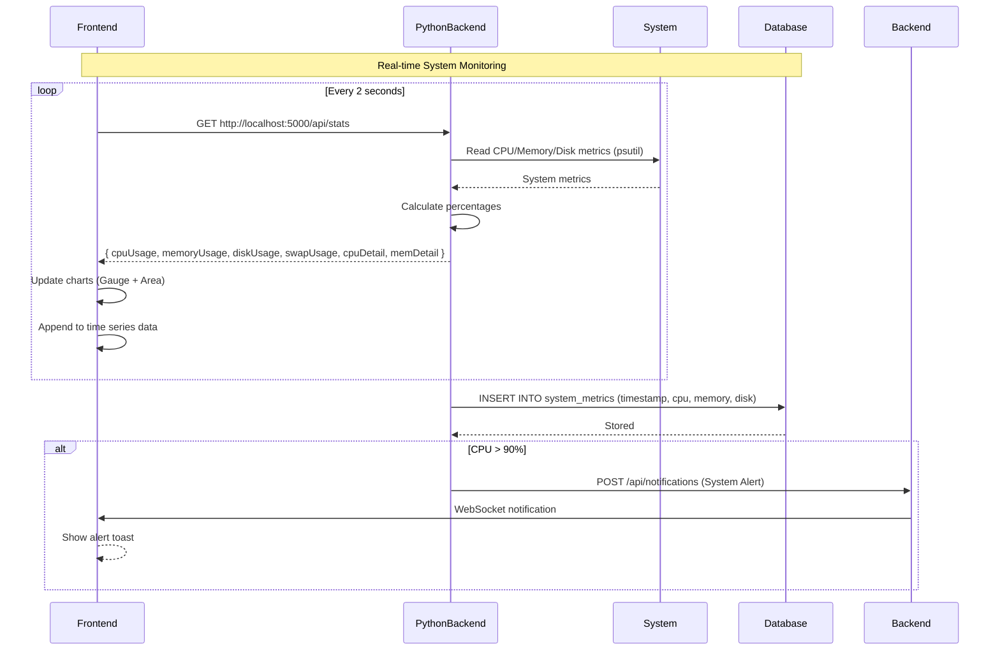
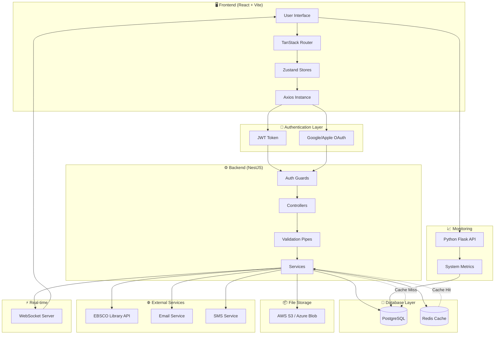

# API List & Data Flow Diagram

## 📋 Tổng quan

Tài liệu này mô tả toàn bộ **API endpoints** và **Data Flow** của hệ thống Tutor Management System (HCMUT). Hiện tại frontend đang sử dụng **mock data**, tài liệu này định nghĩa API cần implement cho backend.

---

## 🌐 API Base Configuration

### Environment Configuration

```typescript
// config/env.ts
const env = import.meta.env;

export const PRODUCTION = env.VITE_APP_PRODUCTION === 'true';
export const API_URL = env.VITE_APP_API_URL;  // http://localhost:3001
export const GOOGLE_OAUTH_CLIENT_ID = env.VITE_APP_GOOGLE_OAUTH_CLIENT_ID;
```

### Axios Instance

```typescript
// utils/custom-axios.ts
import axios from 'axios';
import storage from '@/helpers/storage';

const instance = axios.create({
  baseURL: 'http://localhost:3001', // Backend base URL
  withCredentials: true,
});

// Request Interceptor - Add JWT token to headers
instance.interceptors.request.use(
  (config) => {
    const token: string | null = storage.getItem('token');
    config.headers.Authorization = `Bearer ${token}`;
    return config;
  },
  (error) => {
    console.error('Error in axios');
    Promise.reject(error);
  },
);

export default instance;
```

---

## 📡 API Endpoints List

### 1. **Authentication API** (`/api/auth`)

| Method | Endpoint | Description | Request Body | Response | Status Codes |
|--------|----------|-------------|--------------|----------|--------------|
| POST | `/api/auth/register` | Đăng ký tài khoản mới | `{ email, password, firstName, lastName, role }` | `{ user, accessToken, refreshToken }` | 201, 400, 409 |
| POST | `/api/auth/login` | Đăng nhập | `{ email, password }` | `{ user, accessToken, refreshToken }` | 200, 401 |
| POST | `/api/auth/login/google` | Đăng nhập bằng Google OAuth | `{ credential }` | `{ user, accessToken, refreshToken }` | 200, 401 |
| POST | `/api/auth/login/apple` | Đăng nhập bằng Apple | `{ credential }` | `{ user, accessToken, refreshToken }` | 200, 401 |
| POST | `/api/auth/refresh` | Làm mới access token | `{ refreshToken }` | `{ accessToken }` | 200, 401 |
| POST | `/api/auth/logout` | Đăng xuất | - | `{ message }` | 200 |
| GET | `/api/auth/me` | Lấy thông tin user hiện tại | - | `{ user }` | 200, 401 |
| POST | `/api/auth/forgot-password` | Quên mật khẩu | `{ email }` | `{ message }` | 200, 404 |
| POST | `/api/auth/reset-password` | Reset mật khẩu | `{ token, newPassword }` | `{ message }` | 200, 400 |

**Example Request (Login):**
```typescript
// Frontend: features/~login/~index.tsx
const handleEmailLogin = async (e: React.FormEvent) => {
  const response = await axios.post('/api/auth/login', {
    email,
    password
  });
  
  const { user, accessToken } = response.data;
  setToken(accessToken);
  setUser(user);
  navigate({ to: '/dashboard' });
};
```

---

### 2. **Users API** (`/api/users`)

| Method | Endpoint | Description | Request Body | Response | Status Codes |
|--------|----------|-------------|--------------|----------|--------------|
| GET | `/api/users` | Lấy danh sách users | Query: `?role=student&page=1&limit=20` | `{ users[], total, page }` | 200, 401 |
| GET | `/api/users/:id` | Lấy thông tin user theo ID | - | `{ user }` | 200, 404 |
| POST | `/api/users` | Tạo user mới | `{ email, firstName, lastName, roles[] }` | `{ user }` | 201, 400 |
| PATCH | `/api/users/:id` | Cập nhật user | `{ firstName?, lastName?, phone?, address? }` | `{ user }` | 200, 404 |
| DELETE | `/api/users/:id` | Xóa user (soft delete) | - | `{ message }` | 200, 404 |
| PATCH | `/api/users/:id/roles` | Cập nhật roles | `{ isStudent, isTutor, isCoordinator }` | `{ user }` | 200, 403 |
| GET | `/api/users/search` | Tìm kiếm users | Query: `?q=keyword&role=tutor` | `{ users[] }` | 200 |

---

### 3. **Registrations API** (`/api/registrations`)

| Method | Endpoint | Description | Request Body | Response | Status Codes |
|--------|----------|-------------|--------------|----------|--------------|
| GET | `/api/registrations` | Lấy danh sách registrations | Query: `?status=pending&userId=xxx` | `{ registrations[], total }` | 200, 401 |
| GET | `/api/registrations/:id` | Lấy chi tiết registration | - | `{ registration }` | 200, 404 |
| POST | `/api/registrations` | Tạo registration mới | `{ userId, courseId, language, method, location, specialRequire }` | `{ registration }` | 201, 400 |
| PATCH | `/api/registrations/:id/approve` | Approve registration | `{ tutorId?, classroomId? }` | `{ registration }` | 200, 403 |
| PATCH | `/api/registrations/:id/decline` | Decline registration | `{ declineReason }` | `{ registration }` | 200, 403 |
| PATCH | `/api/registrations/:id/cancel` | Cancel registration | - | `{ registration }` | 200, 403 |
| GET | `/api/registrations/me` | Lấy registrations của user hiện tại | Query: `?status=approved` | `{ registrations[] }` | 200 |

**Frontend Usage:**
```typescript
// features/~_private/~registration-history/~index.tsx
// Current: Using mockPastRegistrations
// Future: Call API
const loadRegistrations = async () => {
  const response = await axios.get('/api/registrations/me');
  setRegistrations(response.data.registrations);
};
```

---

### 4. **Courses API** (`/api/courses`)

| Method | Endpoint | Description | Request Body | Response | Status Codes |
|--------|----------|-------------|--------------|----------|--------------|
| GET | `/api/courses` | Lấy danh sách courses | Query: `?search=network&page=1` | `{ courses[], total, page }` | 200 |
| GET | `/api/courses/:id` | Lấy chi tiết course | - | `{ course }` | 200, 404 |
| POST | `/api/courses` | Tạo course mới | `{ courseCode, courseName, description, languages[], coordinatorId }` | `{ course }` | 201, 400, 403 |
| PATCH | `/api/courses/:id` | Cập nhật course | `{ courseName?, description?, bgImage? }` | `{ course }` | 200, 404, 403 |
| DELETE | `/api/courses/:id` | Xóa course | - | `{ message }` | 200, 404, 403 |
| GET | `/api/courses/:id/statistics` | Lấy thống kê course | - | `{ stats }` | 200, 404 |
| POST | `/api/courses/:id/archive` | Archive course | - | `{ message }` | 200, 403 |

**Frontend Usage:**
```typescript
// features/~_private/~course/~$id/~index.tsx
// Current: Using mockCourses
// Future: 
const loadCourse = async (courseId: string) => {
  const response = await axios.get(`/api/courses/${courseId}`);
  setCourse(response.data.course);
};
```

---

### 5. **Classrooms API** (`/api/classrooms`)

| Method | Endpoint | Description | Request Body | Response | Status Codes |
|--------|----------|-------------|--------------|----------|--------------|
| GET | `/api/classrooms` | Lấy danh sách classrooms | Query: `?courseId=xxx&status=active` | `{ classrooms[], total }` | 200 |
| GET | `/api/classrooms/:id` | Lấy chi tiết classroom | - | `{ classroom }` | 200, 404 |
| POST | `/api/classrooms` | Tạo classroom mới | `{ courseId, tutorId, startDate, endDate }` | `{ classroom }` | 201, 400 |
| PATCH | `/api/classrooms/:id` | Cập nhật classroom | `{ status?, endDate? }` | `{ classroom }` | 200, 403 |
| POST | `/api/classrooms/:id/enroll` | Enroll student | `{ studentId }` | `{ message }` | 200, 400 |
| DELETE | `/api/classrooms/:id/students/:studentId` | Remove student | - | `{ message }` | 200, 403 |
| POST | `/api/classrooms/:id/close` | Close classroom | - | `{ message }` | 200, 403 |
| GET | `/api/classrooms/:id/progress` | Lấy progress | - | `{ progress }` | 200 |

---

### 6. **Materials API** (`/api/materials`)

| Method | Endpoint | Description | Request Body | Response | Status Codes |
|--------|----------|-------------|--------------|----------|--------------|
| GET | `/api/materials` | Lấy materials | Query: `?classroomId=xxx` | `{ materials[] }` | 200 |
| GET | `/api/materials/:id` | Lấy chi tiết material | - | `{ material }` | 200, 404 |
| POST | `/api/materials` | Upload material | `FormData: { file, classroomId, description }` | `{ material }` | 201, 400 |
| PATCH | `/api/materials/:id` | Cập nhật material | `{ description }` | `{ material }` | 200, 403 |
| DELETE | `/api/materials/:id` | Xóa material | - | `{ message }` | 200, 403 |
| GET | `/api/materials/:id/download` | Download material | - | `Blob` | 200, 404 |

**Frontend Usage:**
```typescript
// features/~_private/~course/~$id/~index.tsx
// Upload material
const uploadMaterial = async (file: File, description: string) => {
  const formData = new FormData();
  formData.append('file', file);
  formData.append('classroomId', classroomId);
  formData.append('description', description);
  
  const response = await axios.post('/api/materials', formData, {
    headers: { 'Content-Type': 'multipart/form-data' }
  });
};
```

---

### 7. **Assignments API** (`/api/assignments`)

| Method | Endpoint | Description | Request Body | Response | Status Codes |
|--------|----------|-------------|--------------|----------|--------------|
| GET | `/api/assignments` | Lấy assignments | Query: `?classroomId=xxx` | `{ assignments[] }` | 200 |
| GET | `/api/assignments/:id` | Lấy chi tiết assignment | - | `{ assignment }` | 200, 404 |
| POST | `/api/assignments` | Tạo assignment | `{ classroomId, title, description, deadline, maxScore }` | `{ assignment }` | 201, 400 |
| PATCH | `/api/assignments/:id` | Cập nhật assignment | `{ title?, description?, deadline? }` | `{ assignment }` | 200, 403 |
| DELETE | `/api/assignments/:id` | Xóa assignment | - | `{ message }` | 200, 403 |
| POST | `/api/assignments/:id/publish` | Publish assignment | - | `{ assignment }` | 200, 403 |
| POST | `/api/assignments/:id/close` | Close assignment | - | `{ assignment }` | 200, 403 |
| POST | `/api/assignments/:id/extend` | Extend deadline | `{ newDeadline }` | `{ assignment }` | 200, 403 |
| GET | `/api/assignments/:id/submissions` | Lấy all submissions | - | `{ submissions[] }` | 200 |

---

### 8. **Submissions API** (`/api/submissions`)

| Method | Endpoint | Description | Request Body | Response | Status Codes |
|--------|----------|-------------|--------------|----------|--------------|
| GET | `/api/submissions` | Lấy submissions | Query: `?assignmentId=xxx&studentId=xxx` | `{ submissions[] }` | 200 |
| GET | `/api/submissions/:id` | Lấy chi tiết submission | - | `{ submission }` | 200, 404 |
| POST | `/api/submissions` | Submit assignment | `FormData: { file, assignmentId }` | `{ submission }` | 201, 400 |
| PATCH | `/api/submissions/:id` | Resubmit | `FormData: { file }` | `{ submission }` | 200, 403 |
| PATCH | `/api/submissions/:id/grade` | Grade submission | `{ grade, tutorComment }` | `{ submission }` | 200, 403 |
| GET | `/api/submissions/:id/download` | Download submission | - | `Blob` | 200, 404 |

**Frontend Usage:**
```typescript
// features/~_private/~course/~$id/~submissions/~index.tsx
// Current: Using getSubmissionsForClassroom()
// Future:
const loadSubmissions = async () => {
  const response = await axios.get(`/api/submissions?classroomId=${classroomId}`);
  setSubmissions(response.data.submissions);
};
```

---

### 9. **Sessions API** (`/api/sessions`)

| Method | Endpoint | Description | Request Body | Response | Status Codes |
|--------|----------|-------------|--------------|----------|--------------|
| GET | `/api/sessions` | Lấy sessions | Query: `?classroomId=xxx&status=scheduled` | `{ sessions[] }` | 200 |
| GET | `/api/sessions/:id` | Lấy chi tiết session | - | `{ session }` | 200, 404 |
| POST | `/api/sessions` | Tạo session | `{ classroomId, title, startTime, endTime, type, location?, meetingLink? }` | `{ session }` | 201, 400 |
| PATCH | `/api/sessions/:id` | Cập nhật session | `{ title?, startTime?, endTime? }` | `{ session }` | 200, 403 |
| DELETE | `/api/sessions/:id` | Xóa session | - | `{ message }` | 200, 403 |
| POST | `/api/sessions/:id/cancel` | Cancel session | `{ reason }` | `{ message }` | 200, 403 |
| POST | `/api/sessions/:id/complete` | Complete session | - | `{ message }` | 200, 403 |
| POST | `/api/sessions/:id/reschedule` | Reschedule session | `{ newStartTime, newEndTime }` | `{ session }` | 200, 403 |
| POST | `/api/sessions/:id/attendance` | Mark attendance | `{ studentId, isPresent, reason? }` | `{ attendanceRecord }` | 200, 403 |
| GET | `/api/sessions/:id/attendance-rate` | Lấy attendance rate | - | `{ rate }` | 200 |

**Frontend Usage:**
```typescript
// features/~_private/~schedule/~$id/~index.tsx
// Current: Using getSessionById(), updateSession()
// Future:
const loadSession = async (sessionId: string) => {
  const response = await axios.get(`/api/sessions/${sessionId}`);
  setSession(response.data.session);
};

const markAttendance = async (studentId: string, isPresent: boolean) => {
  await axios.post(`/api/sessions/${sessionId}/attendance`, {
    studentId,
    isPresent
  });
};
```

---

### 10. **Session Requests API** (`/api/session-requests`)

| Method | Endpoint | Description | Request Body | Response | Status Codes |
|--------|----------|-------------|--------------|----------|--------------|
| GET | `/api/session-requests` | Lấy session requests | Query: `?status=pending&classroomId=xxx` | `{ requests[] }` | 200 |
| GET | `/api/session-requests/:id` | Lấy chi tiết request | - | `{ request }` | 200, 404 |
| POST | `/api/session-requests` | Tạo session request | `{ classroomId, requestType, reason, sessionId? }` | `{ request }` | 201, 400 |
| PATCH | `/api/session-requests/:id/approve` | Approve request | `{ tutorResponse }` | `{ request }` | 200, 403 |
| PATCH | `/api/session-requests/:id/reject` | Reject request | `{ tutorResponse }` | `{ request }` | 200, 403 |
| PATCH | `/api/session-requests/:id/cancel` | Cancel request | - | `{ request }` | 200, 403 |

**Frontend Usage:**
```typescript
// features/~_private/~schedule/~request/~index.tsx
// Create new session request
const createRequest = async () => {
  const response = await axios.post('/api/session-requests', {
    classroomId: searchParams.courseId,
    requestType: searchParams.requestType || 'NEW',
    reason: searchParams.desc
  });
};
```

---

### 11. **Session Notes API** (`/api/session-notes`)

| Method | Endpoint | Description | Request Body | Response | Status Codes |
|--------|----------|-------------|--------------|----------|--------------|
| GET | `/api/session-notes` | Lấy session notes | Query: `?sessionId=xxx` | `{ notes[] }` | 200 |
| GET | `/api/session-notes/:id` | Lấy chi tiết note | - | `{ note }` | 200, 404 |
| POST | `/api/session-notes` | Tạo session note | `{ sessionId, content, filePath?, attendance[] }` | `{ note }` | 201, 400 |
| PATCH | `/api/session-notes/:id` | Cập nhật note | `{ content?, attendance[]? }` | `{ note }` | 200, 403 |
| DELETE | `/api/session-notes/:id` | Xóa note | - | `{ message }` | 200, 403 |

---

### 12. **Tutor Ratings API** (`/api/tutor-ratings`)

| Method | Endpoint | Description | Request Body | Response | Status Codes |
|--------|----------|-------------|--------------|----------|--------------|
| GET | `/api/tutor-ratings` | Lấy ratings | Query: `?tutorId=xxx&classroomId=xxx` | `{ ratings[] }` | 200 |
| GET | `/api/tutor-ratings/:id` | Lấy chi tiết rating | - | `{ rating }` | 200, 404 |
| POST | `/api/tutor-ratings` | Tạo rating | `{ tutorId, classroomId, sessionId?, criteriaRatings, comment }` | `{ rating }` | 201, 400 |
| PATCH | `/api/tutor-ratings/:id` | Cập nhật rating | `{ criteriaRatings?, comment? }` | `{ rating }` | 200, 403 |
| DELETE | `/api/tutor-ratings/:id` | Xóa rating | - | `{ message }` | 200, 403 |
| GET | `/api/tutor-ratings/tutor/:tutorId/average` | Lấy average rating | - | `{ averageScore, totalRatings }` | 200 |

**Frontend Usage:**
```typescript
// features/~_private/~course/~$id/~rating/~$id/~$index/~index.tsx
const submitRating = async () => {
  await axios.post('/api/tutor-ratings', {
    tutorId,
    classroomId,
    criteriaRatings: {
      teaching: 4.5,
      communication: 5.0,
      punctuality: 4.0,
      helpfulness: 5.0,
      expertise: 4.5
    },
    comment: "Great tutor!"
  });
};
```

---

### 13. **Class Feedback API** (`/api/class-feedback`)

| Method | Endpoint | Description | Request Body | Response | Status Codes |
|--------|----------|-------------|--------------|----------|--------------|
| GET | `/api/class-feedback` | Lấy feedback | Query: `?classroomId=xxx` | `{ feedbacks[] }` | 200 |
| GET | `/api/class-feedback/:id` | Lấy chi tiết feedback | - | `{ feedback }` | 200, 404 |
| POST | `/api/class-feedback` | Tạo feedback | `{ classroomId, overallPerformance, strengths, areasForImprovement, suggestions, performanceScore }` | `{ feedback }` | 201, 400 |
| PATCH | `/api/class-feedback/:id` | Cập nhật feedback | `{ overallPerformance?, suggestions? }` | `{ feedback }` | 200, 403 |
| POST | `/api/class-feedback/:id/archive` | Archive feedback | - | `{ message }` | 200, 403 |

---

### 14. **Chat Channels API** (`/api/chat-channels`)

| Method | Endpoint | Description | Request Body | Response | Status Codes |
|--------|----------|-------------|--------------|----------|--------------|
| GET | `/api/chat-channels` | Lấy channels của user | - | `{ channels[] }` | 200 |
| GET | `/api/chat-channels/:id` | Lấy chi tiết channel | - | `{ channel }` | 200, 404 |
| POST | `/api/chat-channels` | Tạo channel | `{ channelName, participantIds[], type, classroomId? }` | `{ channel }` | 201, 400 |
| POST | `/api/chat-channels/:id/participants` | Add participant | `{ userId }` | `{ message }` | 200, 403 |
| DELETE | `/api/chat-channels/:id/participants/:userId` | Remove participant | - | `{ message }` | 200, 403 |
| POST | `/api/chat-channels/:id/archive` | Archive channel | - | `{ message }` | 200, 403 |
| GET | `/api/chat-channels/:id/messages` | Lấy messages | Query: `?limit=50&before=timestamp` | `{ messages[] }` | 200 |

**Frontend Usage:**
```typescript
// components/study-layout/chat-popup.tsx
// Current: Using mockConversations
// Future:
const loadChannels = async () => {
  const response = await axios.get('/api/chat-channels');
  setChannels(response.data.channels);
};
```

---

### 15. **Messages API** (`/api/messages`)

| Method | Endpoint | Description | Request Body | Response | Status Codes |
|--------|----------|-------------|--------------|----------|--------------|
| GET | `/api/messages` | Lấy messages | Query: `?channelId=xxx&limit=100` | `{ messages[] }` | 200 |
| GET | `/api/messages/:id` | Lấy chi tiết message | - | `{ message }` | 200, 404 |
| POST | `/api/messages` | Send message | `{ channelId, content, messageType?, attachments[]? }` | `{ message }` | 201, 400 |
| PATCH | `/api/messages/:id` | Edit message | `{ content }` | `{ message }` | 200, 403 |
| DELETE | `/api/messages/:id` | Delete message | - | `{ message }` | 200, 403 |
| POST | `/api/messages/:id/react` | React to message | `{ emoji }` | `{ message }` | 200 |

---

### 16. **Notifications API** (`/api/notifications`)

| Method | Endpoint | Description | Request Body | Response | Status Codes |
|--------|----------|-------------|--------------|----------|--------------|
| GET | `/api/notifications` | Lấy notifications | Query: `?isRead=false&limit=50` | `{ notifications[] }` | 200 |
| GET | `/api/notifications/:id` | Lấy chi tiết notification | - | `{ notification }` | 200, 404 |
| POST | `/api/notifications` | Send notification | `{ recipientId, title, content, type, link? }` | `{ notification }` | 201, 400, 403 |
| PATCH | `/api/notifications/:id/read` | Mark as read | - | `{ notification }` | 200 |
| PATCH | `/api/notifications/read-all` | Mark all as read | - | `{ message }` | 200 |
| DELETE | `/api/notifications/:id` | Delete notification | - | `{ message }` | 200 |
| GET | `/api/notifications/unread-count` | Lấy số thông báo chưa đọc | - | `{ count }` | 200 |

**Frontend Usage:**
```typescript
// components/study-layout/notification-popup.tsx
const loadNotifications = async () => {
  const response = await axios.get('/api/notifications?limit=20');
  setNotifications(response.data.notifications);
};
```

---

### 17. **Statistics API** (`/api/statistics`)

| Method | Endpoint | Description | Request Body | Response | Status Codes |
|--------|----------|-------------|--------------|----------|--------------|
| GET | `/api/statistics/overview` | Tổng quan hệ thống | - | `{ totalUsers, totalCourses, activeSessions, ... }` | 200, 403 |
| GET | `/api/statistics/courses/:id` | Thống kê course | - | `{ enrollments, completionRate, ... }` | 200 |
| GET | `/api/statistics/tutors/:id` | Thống kê tutor | - | `{ avgRating, totalSessions, ... }` | 200 |
| GET | `/api/statistics/students/:id` | Thống kê student | - | `{ coursesEnrolled, avgGrade, ... }` | 200 |

**Frontend Usage:**
```typescript
// features/~_private/~statistical/~overview/~index.tsx
// features/~_private/~statistical/~$id/~index.tsx
const loadStatistics = async () => {
  const response = await axios.get('/api/statistics/overview');
  setStats(response.data);
};
```

---

### 18. **System Monitoring API** (`/api/system`)

| Method | Endpoint | Description | Response | Status Codes |
|--------|----------|-------------|----------|--------------|
| GET | `/api/system/stats` | Lấy system stats (CPU, RAM, Disk) | `{ cpuUsage, memoryUsage, diskUsage, ... }` | 200, 403 |
| GET | `/api/system/health` | Health check | `{ status, uptime, ... }` | 200 |

**Frontend Usage:**
```typescript
// features/~_private/~system-monitoring/~index.tsx
useEffect(() => {
  const fetchStats = async () => {
    const response = await fetch('http://localhost:5000/api/stats'); // Python backend
    const data: SystemStats = await response.json();
    setStats(data);
  };
  
  const interval = setInterval(fetchStats, 2000);
  return () => clearInterval(interval);
}, []);
```

---

### 19. **Library Search API** (`/api/library`)

| Method | Endpoint | Description | Request Body | Response | Status Codes |
|--------|----------|-------------|--------------|----------|--------------|
| GET | `/api/library/search` | Search VNU Library via EBSCO | Query: `?query=network&page=1&limit=20` | `{ books[], total, page, hasMore }` | 200 |

**Frontend Usage:**
```typescript
// utils/vnu-library.ts
export const searchVNULibrary = async (query: string, page: number = 1, limit: number = 20) => {
  // OPTION 1: Direct EBSCO (CORS issues)
  // OPTION 2: Backend Proxy (recommended)
  const response = await axios.get('http://localhost:3000/api/search-library', {
    params: { query, page, limit },
    timeout: 15000,
  });
  return response.data; // BookSearchResponse
};
```

---

## 🔄 Data Flow Diagrams

### 1. **Authentication Flow**



---

### 2. **Registration Flow (Student → Coordinator → Classroom)**



---

### 3. **Session Creation & Attendance Flow**



---

### 4. **Assignment Submission & Grading Flow**



---

### 5. **Real-time Chat Flow**



---

### 6. **Notification Flow**



---

### 7. **Statistics Dashboard Flow**



---

### 8. **System Monitoring Flow (Python Backend)**



---

## 📊 Complete Data Flow Architecture



---

## 🔧 Implementation Checklist

### Phase 1: Core APIs (Authentication & Users)
- [ ] POST /api/auth/register
- [ ] POST /api/auth/login
- [ ] POST /api/auth/refresh
- [ ] GET /api/auth/me
- [ ] GET /api/users
- [ ] GET /api/users/:id
- [ ] PATCH /api/users/:id

### Phase 2: Academic Management
- [ ] GET /api/courses
- [ ] POST /api/courses
- [ ] GET /api/registrations
- [ ] POST /api/registrations
- [ ] PATCH /api/registrations/:id/approve
- [ ] GET /api/classrooms
- [ ] POST /api/classrooms
- [ ] POST /api/classrooms/:id/enroll

### Phase 3: Learning Materials
- [ ] POST /api/materials (with file upload)
- [ ] GET /api/materials
- [ ] POST /api/assignments
- [ ] GET /api/assignments
- [ ] POST /api/submissions (with file upload)
- [ ] PATCH /api/submissions/:id/grade

### Phase 4: Sessions & Scheduling
- [ ] POST /api/sessions
- [ ] GET /api/sessions
- [ ] POST /api/sessions/:id/attendance
- [ ] POST /api/session-requests
- [ ] PATCH /api/session-requests/:id/approve
- [ ] POST /api/session-notes

### Phase 5: Communication
- [ ] GET /api/chat-channels
- [ ] POST /api/chat-channels
- [ ] GET /api/messages
- [ ] POST /api/messages
- [ ] WebSocket implementation for real-time chat

### Phase 6: Feedback & Ratings
- [ ] POST /api/tutor-ratings
- [ ] GET /api/tutor-ratings
- [ ] POST /api/class-feedback
- [ ] GET /api/class-feedback

### Phase 7: Notifications & Statistics
- [ ] GET /api/notifications
- [ ] POST /api/notifications
- [ ] WebSocket for real-time notifications
- [ ] GET /api/statistics/overview
- [ ] GET /api/statistics/courses/:id
- [ ] GET /api/statistics/tutors/:id

### Phase 8: System & External
- [ ] GET /api/system/stats (Python backend)
- [ ] GET /api/library/search (EBSCO proxy)

---

## 🚀 Usage Examples

### Example 1: Complete Student Registration Flow

```typescript
// Student fills form and submits
const handleRegister = async () => {
  try {
    // Step 1: Create registration
    const response = await axios.post('/api/registrations', {
      userId: user.userId,
      courseId: selectedCourse.courseId,
      language: 'VIETNAMESE',
      method: 'HYBRID',
      location: 'District 1, HCMC',
      specialRequire: 'Need evening classes'
    });

    toast.success('Registration submitted successfully!');
    
    // Step 2: Poll for status updates (or use WebSocket)
    const checkStatus = setInterval(async () => {
      const statusRes = await axios.get(`/api/registrations/${response.data.registration.registrationId}`);
      
      if (statusRes.data.registration.status === 'APPROVED') {
        clearInterval(checkStatus);
        toast.success('Registration approved! You can now access the classroom.');
        navigate({ to: `/course/${statusRes.data.registration.classroomId}` });
      } else if (statusRes.data.registration.status === 'DECLINED') {
        clearInterval(checkStatus);
        toast.error(`Registration declined: ${statusRes.data.registration.declineReason}`);
      }
    }, 5000);
    
  } catch (error) {
    handleAxiosError(error, (message) => toast.error(message));
  }
};
```

### Example 2: Real-time Chat Implementation

```typescript
import io from 'socket.io-client';

// Initialize WebSocket connection
const socket = io('ws://localhost:3001', {
  auth: { token: localStorage.getItem('token') }
});

// Join channel
socket.emit('join-channel', { channelId });

// Listen for new messages
socket.on('new-message', (message) => {
  setMessages(prev => [...prev, message]);
});

// Send message
const sendMessage = (content: string) => {
  socket.emit('send-message', {
    channelId,
    content,
    messageType: 'TEXT'
  });
};

// Typing indicator
const handleTyping = () => {
  socket.emit('typing', { channelId });
};

socket.on('user-typing', ({ userId, channelId }) => {
  setTypingUsers(prev => [...prev, userId]);
  setTimeout(() => {
    setTypingUsers(prev => prev.filter(id => id !== userId));
  }, 3000);
});
```

### Example 3: File Upload with Progress

```typescript
const uploadMaterial = async (file: File) => {
  const formData = new FormData();
  formData.append('file', file);
  formData.append('classroomId', classroomId);
  formData.append('description', description);
  
  try {
    const response = await axios.post('/api/materials', formData, {
      headers: { 'Content-Type': 'multipart/form-data' },
      onUploadProgress: (progressEvent) => {
        const percentCompleted = Math.round((progressEvent.loaded * 100) / progressEvent.total);
        setUploadProgress(percentCompleted);
      }
    });
    
    toast.success('Material uploaded successfully!');
    return response.data.material;
  } catch (error) {
    handleAxiosError(error, (message) => toast.error(message));
  }
};
```

---

## 📝 Notes

1. **Hiện trạng:** Frontend đang sử dụng **mock data** từ các file trong `components/data/~mock-*.ts`
2. **Backend chưa implement:** Cần build NestJS backend theo API spec này
3. **Authentication:** JWT-based authentication với refresh token mechanism
4. **File Storage:** Cần setup AWS S3 hoặc Azure Blob Storage
5. **Real-time:** Cần implement WebSocket cho chat và notifications
6. **System Monitoring:** Python Flask backend riêng (port 5000) cho system metrics
7. **External API:** EBSCO library search cần backend proxy để tránh CORS

---

**Document Version:** 1.0  
**Last Updated:** November 15, 2025  
**Author:** HCMUT Development Team
