# Class Diagram - HCMUT Tutor Management System

## 📋 Tổng quan

Đây là Class Diagram hoàn chỉnh cho hệ thống quản lý gia sư HCMUT, bao gồm tất cả các entity chính và mối quan hệ giữa chúng.

---

## 🎨 Class Diagram (UML)

```mermaid
classDiagram
    %% ==================== CORE ENTITIES ====================
    
    class User {
        +String userId
        +String email
        +String firstName
        +String lastName
        +String picture
        +String phone
        +String address
        +String dateOfBirth
        +String highSchool
        +Boolean isStudent
        +Boolean isTutor
        +Boolean isCoordinator
        +Boolean isManager
        +Boolean isChairman
        +Boolean statisticalPermission
        +String googleId
        +String appleId
        +SocialMedia socialMedia
        +DateTime createdAt
        +DateTime updatedAt
        +DateTime deletedAt
        +register()
        +login()
        +updateProfile()
        +deactivate()
    }

    class SocialMedia {
        +String facebookUrl
        +String facebookName
    }

    %% ==================== REGISTRATION & COURSES ====================

    class Registration {
        +String registrationId
        +String userId
        +String courseId
        +RegistrationStatus status
        +String language
        +SessionMethod method
        +String location
        +String specialRequire
        +String declineReason
        +DateTime createdAt
        +DateTime updatedAt
        +submit()
        +approve()
        +decline()
        +cancel()
    }

    class Course {
        +String courseId
        +String courseCode
        +String courseName
        +String description
        +String coordinatorId
        +Language[] languages
        +String bgImage
        +CourseStats stats
        +DateTime createdAt
        +DateTime updatedAt
        +create()
        +update()
        +delete()
        +archive()
    }

    class CourseStats {
        +Integer documents
        +Integer links
        +Integer assignments
        +Integer sessionsOrganized
    }

    class Classroom {
        +String classroomId
        +String courseId
        +String tutorId
        +String[] studentIds
        +String[] materialIds
        +String[] assignmentIds
        +ClassroomStatus status
        +DateTime startDate
        +DateTime endDate
        +DateTime createdAt
        +DateTime updatedAt
        +enrollStudent()
        +removeStudent()
        +addMaterial()
        +createAssignment()
        +close()
    }

    %% ==================== MATERIALS & ASSIGNMENTS ====================

    class Material {
        +String materialId
        +String classroomId
        +String uploaderId
        +String fileName
        +String filePath
        +String fileType
        +Long fileSize
        +String description
        +DateTime uploadedAt
        +DateTime updatedAt
        +upload()
        +download()
        +delete()
        +updateDescription()
    }

    class Assignment {
        +String assignmentId
        +String classroomId
        +String tutorId
        +String title
        +String description
        +String instructions
        +DateTime deadline
        +Integer maxScore
        +AssignmentStatus status
        +DateTime createdAt
        +DateTime updatedAt
        +create()
        +update()
        +delete()
        +extend()
        +close()
    }

    class Submission {
        +String submissionId
        +String assignmentId
        +String studentId
        +String filePath
        +String fileName
        +Float grade
        +String tutorComment
        +SubmissionStatus status
        +DateTime submittedAt
        +DateTime gradedAt
        +DateTime updatedAt
        +submit()
        +resubmit()
        +grade()
        +addComment()
    }

    %% ==================== SESSIONS ====================

    class Session {
        +String sessionId
        +String classroomId
        +String tutorId
        +String title
        +String description
        +DateTime startTime
        +DateTime endTime
        +SessionType type
        +String location
        +String meetingLink
        +SessionStatus status
        +String[] attendanceIds
        +DateTime createdAt
        +DateTime updatedAt
        +schedule()
        +cancel()
        +complete()
        +reschedule()
    }

    class SessionRequest {
        +String requestId
        +String studentId
        +String classroomId
        +String sessionId
        +RequestType requestType
        +String reason
        +RequestStatus status
        +String tutorResponse
        +DateTime requestedAt
        +DateTime respondedAt
        +DateTime updatedAt
        +submit()
        +approve()
        +reject()
        +cancel()
    }

    class SessionNote {
        +String noteId
        +String sessionId
        +String tutorId
        +String content
        +String filePath
        +String[] attendanceIds
        +AttendanceRecord[] attendance
        +DateTime createdAt
        +DateTime updatedAt
        +create()
        +update()
        +delete()
        +markAttendance()
    }

    class AttendanceRecord {
        +String recordId
        +String studentId
        +String sessionId
        +Boolean isPresent
        +String reason
        +DateTime recordedAt
    }

    %% ==================== RATINGS & FEEDBACK ====================

    class TutorRating {
        +String ratingId
        +String studentId
        +String tutorId
        +String classroomId
        +String sessionId
        +CriteriaRatings criteriaRatings
        +String comment
        +Float overallScore
        +DateTime createdAt
        +DateTime updatedAt
        +submit()
        +update()
        +delete()
    }

    class CriteriaRatings {
        +Float teaching
        +Float communication
        +Float punctuality
        +Float helpfulness
        +Float expertise
    }

    class ClassFeedback {
        +String feedbackId
        +String tutorId
        +String classroomId
        +String overallPerformance
        +String strengths
        +String areasForImprovement
        +String suggestions
        +Float performanceScore
        +DateTime createdAt
        +DateTime updatedAt
        +submit()
        +update()
        +archive()
    }

    %% ==================== COMMUNICATION ====================

    class ChatChannel {
        +String channelId
        +String channelName
        +String classroomId
        +String[] participantIds
        +ChannelType type
        +String description
        +Boolean isGroup
        +DateTime createdAt
        +DateTime updatedAt
        +create()
        +addParticipant()
        +removeParticipant()
        +archive()
    }

    class Message {
        +String messageId
        +String channelId
        +String senderId
        +String content
        +String[] attachments
        +MessageType messageType
        +Boolean isEdited
        +Boolean isDeleted
        +DateTime timestamp
        +DateTime editedAt
        +send()
        +edit()
        +delete()
        +react()
    }

    class Notification {
        +String notificationId
        +String recipientId
        +String senderId
        +String title
        +String content
        +NotificationType type
        +Boolean isRead
        +String link
        +String metadata
        +DateTime createdAt
        +DateTime readAt
        +send()
        +markAsRead()
        +delete()
    }

    %% ==================== ENUMS ====================

    class RegistrationStatus {
        <<enumeration>>
        PENDING
        APPROVED
        DECLINED
        CANCELLED
    }

    class SessionMethod {
        <<enumeration>>
        ONLINE
        HYBRID
        OFFLINE
    }

    class Language {
        <<enumeration>>
        VIETNAMESE
        ENGLISH
        CHINESE
        THAI
    }

    class ClassroomStatus {
        <<enumeration>>
        ACTIVE
        COMPLETED
        ARCHIVED
        CANCELLED
    }

    class AssignmentStatus {
        <<enumeration>>
        DRAFT
        PUBLISHED
        CLOSED
        EXTENDED
    }

    class SubmissionStatus {
        <<enumeration>>
        PENDING
        SUBMITTED
        GRADED
        LATE
        RESUBMITTED
    }

    class SessionType {
        <<enumeration>>
        ONLINE
        OFFLINE
        HYBRID
    }

    class SessionStatus {
        <<enumeration>>
        SCHEDULED
        COMPLETED
        CANCELLED
        RESCHEDULED
    }

    class RequestType {
        <<enumeration>>
        NEW
        MAKEUP
        ABSENT
        RESCHEDULE
    }

    class RequestStatus {
        <<enumeration>>
        PENDING
        APPROVED
        REJECTED
        CANCELLED
    }

    class ChannelType {
        <<enumeration>>
        DIRECT_MESSAGE
        GROUP_CHAT
        CLASSROOM_CHAT
        DEPARTMENT_CHAT
    }

    class MessageType {
        <<enumeration>>
        TEXT
        IMAGE
        FILE
        LINK
        SYSTEM
    }

    class NotificationType {
        <<enumeration>>
        INFO
        WARNING
        SUCCESS
        ERROR
        ASSIGNMENT
        SESSION
        RATING
        MESSAGE
    }

    %% ==================== RELATIONSHIPS ====================

    %% User relationships
    User "1" -- "0..1" SocialMedia : has
    User "1" -- "*" Registration : creates
    User "1" -- "*" Classroom : teaches/enrolls
    User "1" -- "*" Material : uploads
    User "1" -- "*" Assignment : creates
    User "1" -- "*" Submission : submits
    User "1" -- "*" TutorRating : rates/receives
    User "1" -- "*" ClassFeedback : writes/receives
    User "1" -- "*" Message : sends
    User "1" -- "*" Notification : receives/sends
    User "1" -- "*" SessionRequest : creates
    User "1" -- "*" SessionNote : writes

    %% Registration & Course
    Registration "*" -- "1" User : belongs to
    Registration "*" -- "1" Course : for
    Course "1" -- "1" CourseStats : has
    Course "1" -- "*" Classroom : has
    Course "1" -- "1" User : coordinated by

    %% Classroom relationships
    Classroom "*" -- "1" Course : based on
    Classroom "1" -- "1" User : taught by
    Classroom "*" -- "*" User : enrolled students
    Classroom "1" -- "*" Material : contains
    Classroom "1" -- "*" Assignment : has
    Classroom "1" -- "*" Session : schedules
    Classroom "1" -- "*" ChatChannel : has
    Classroom "1" -- "*" TutorRating : receives
    Classroom "1" -- "*" ClassFeedback : receives

    %% Materials & Assignments
    Material "*" -- "1" Classroom : belongs to
    Material "*" -- "1" User : uploaded by
    
    Assignment "*" -- "1" Classroom : belongs to
    Assignment "*" -- "1" User : created by
    Assignment "1" -- "*" Submission : has

    Submission "*" -- "1" Assignment : for
    Submission "*" -- "1" User : submitted by

    %% Sessions
    Session "*" -- "1" Classroom : belongs to
    Session "*" -- "1" User : taught by
    Session "1" -- "*" SessionRequest : has
    Session "1" -- "0..1" SessionNote : has
    Session "1" -- "*" AttendanceRecord : tracks

    SessionRequest "*" -- "1" User : requested by
    SessionRequest "*" -- "1" Classroom : for
    SessionRequest "*" -- "0..1" Session : related to

    SessionNote "*" -- "1" Session : belongs to
    SessionNote "*" -- "1" User : written by
    SessionNote "1" -- "*" AttendanceRecord : contains

    AttendanceRecord "*" -- "1" User : for student
    AttendanceRecord "*" -- "1" Session : belongs to

    %% Ratings & Feedback
    TutorRating "*" -- "1" User : rated by student
    TutorRating "*" -- "1" User : rates tutor
    TutorRating "*" -- "1" Classroom : for
    TutorRating "1" -- "1" CriteriaRatings : has
    TutorRating "*" -- "0..1" Session : for

    ClassFeedback "*" -- "1" User : written by tutor
    ClassFeedback "*" -- "1" Classroom : for

    %% Communication
    ChatChannel "*" -- "0..1" Classroom : belongs to
    ChatChannel "*" -- "*" User : has participants
    ChatChannel "1" -- "*" Message : contains

    Message "*" -- "1" ChatChannel : in
    Message "*" -- "1" User : sent by

    Notification "*" -- "1" User : for recipient
    Notification "*" -- "0..1" User : sent by

    %% Enum relationships
    Registration -- RegistrationStatus : has
    Registration -- SessionMethod : uses
    Registration -- Language : requires
    Classroom -- ClassroomStatus : has
    Assignment -- AssignmentStatus : has
    Submission -- SubmissionStatus : has
    Session -- SessionType : is
    Session -- SessionStatus : has
    SessionRequest -- RequestType : is
    SessionRequest -- RequestStatus : has
    ChatChannel -- ChannelType : is
    Message -- MessageType : is
    Notification -- NotificationType : is
```



---

## 📊 Chi tiết các Class và Attributes

### 1. **User (Người dùng)**

```typescript
class User {
  // Identity & Authentication
  userId: string (PK)
  email: string (unique, required)
  googleId: string (unique)
  appleId: string | null
  
  // Personal Information
  firstName: string | null
  lastName: string | null
  picture: string | null (avatar URL)
  phone: string | null
  address: string
  dateOfBirth: string | null (ISO date)
  highSchool: string | null
  
  // Role-based Access Control
  isStudent: boolean (default: false)
  isTutor: boolean (default: false)
  isCoordinator: boolean (default: false)
  isManager: boolean (default: false)
  isChairman: boolean (default: false)
  statisticalPermission: boolean (default: false)
  
  // Social Integration
  socialMedia: {
    facebookUrl?: string
    facebookName?: string
  }
  
  // Audit Fields
  createdAt: DateTime
  updatedAt: DateTime
  deletedAt: DateTime | null (soft delete)
  
  // Methods
  + register(): void
  + login(): Token
  + updateProfile(data: ProfileData): User
  + deactivate(): void
  + hasRole(role: string): boolean
}
```

**Giải thích:**
- Lớp trung tâm của hệ thống, quản lý tất cả người dùng
- Hỗ trợ multi-role: một user có thể đồng thời là student, tutor, coordinator
- Sử dụng OAuth (Google, Apple) cho authentication
- Soft delete để giữ lịch sử dữ liệu

---

### 2. **Registration (Đăng ký học)**

```typescript
class Registration {
  // Primary Key
  registrationId: string (PK)
  
  // Foreign Keys
  userId: string (FK -> User)
  courseId: string (FK -> Course)
  
  // Registration Details
  status: RegistrationStatus (PENDING | APPROVED | DECLINED | CANCELLED)
  language: Language (VIETNAMESE | ENGLISH | CHINESE | THAI)
  method: SessionMethod (ONLINE | HYBRID | OFFLINE)
  location: string | null (required if method = OFFLINE/HYBRID)
  specialRequire: string (special requirements from student)
  
  // Response
  declineReason: string | null (reason if status = DECLINED)
  
  // Audit Fields
  createdAt: DateTime
  updatedAt: DateTime
  
  // Methods
  + submit(): Registration
  + approve(): void
  + decline(reason: string): void
  + cancel(): void
  + canEdit(): boolean
}
```

**Giải thích:**
- Quản lý đơn đăng ký học của students
- Coordinator/Manager review và approve/decline
- Tracking lifecycle: PENDING → APPROVED/DECLINED

---

### 3. **Course (Khóa học)**

```typescript
class Course {
  // Primary Key
  courseId: string (PK)
  
  // Course Information
  courseCode: string (unique, e.g., "CO2013_003183_CLC")
  courseName: string (e.g., "Computer Network")
  description: string
  coordinatorId: string (FK -> User)
  
  // Settings
  languages: Language[] (supported languages)
  bgImage: string (background image URL)
  
  // Statistics (nested object)
  stats: {
    documents: number
    links: number
    assignments: number
    sessionsOrganized: number
  }
  
  // Audit Fields
  createdAt: DateTime
  updatedAt: DateTime
  
  // Methods
  + create(): Course
  + update(data: CourseData): Course
  + delete(): void
  + archive(): void
  + getStatistics(): CourseStats
}
```

**Giải thích:**
- Định nghĩa môn học/khóa học
- Coordinator (giảng viên phụ trách) quản lý course
- Stats tracking để hiển thị dashboard

---

### 4. **Classroom (Lớp học)**

```typescript
class Classroom {
  // Primary Key
  classroomId: string (PK)
  
  // Foreign Keys
  courseId: string (FK -> Course)
  tutorId: string (FK -> User)
  
  // Participants
  studentIds: string[] (FK -> User[])
  
  // Resources
  materialIds: string[] (FK -> Material[])
  assignmentIds: string[] (FK -> Assignment[])
  
  // Status & Timeline
  status: ClassroomStatus (ACTIVE | COMPLETED | ARCHIVED | CANCELLED)
  startDate: DateTime
  endDate: DateTime
  
  // Audit Fields
  createdAt: DateTime
  updatedAt: DateTime
  
  // Methods
  + enrollStudent(studentId: string): void
  + removeStudent(studentId: string): void
  + addMaterial(material: Material): void
  + createAssignment(assignment: Assignment): void
  + close(): void
  + getProgress(): number
}
```

**Giải thích:**
- Instance cụ thể của Course, do Tutor dạy
- Chứa students, materials, assignments, sessions
- Lifecycle: ACTIVE → COMPLETED → ARCHIVED

---

### 5. **Material (Tài liệu)**

```typescript
class Material {
  // Primary Key
  materialId: string (PK)
  
  // Foreign Keys
  classroomId: string (FK -> Classroom)
  uploaderId: string (FK -> User)
  
  // File Information
  fileName: string
  filePath: string (storage path/URL)
  fileType: string (MIME type, e.g., "application/pdf")
  fileSize: number (bytes)
  description: string
  
  // Audit Fields
  uploadedAt: DateTime
  updatedAt: DateTime
  
  // Methods
  + upload(file: File): Material
  + download(): Blob
  + delete(): void
  + updateDescription(desc: string): void
  + getUrl(): string
}
```

**Giải thích:**
- Tài liệu học tập (PDF, slides, videos...)
- Tutor/Coordinator upload
- Lưu trữ file path hoặc cloud storage URL

---

### 6. **Assignment (Bài tập)**

```typescript
class Assignment {
  // Primary Key
  assignmentId: string (PK)
  
  // Foreign Keys
  classroomId: string (FK -> Classroom)
  tutorId: string (FK -> User)
  
  // Assignment Details
  title: string
  description: string
  instructions: string (detailed instructions)
  deadline: DateTime
  maxScore: number (e.g., 10.0)
  status: AssignmentStatus (DRAFT | PUBLISHED | CLOSED | EXTENDED)
  
  // Audit Fields
  createdAt: DateTime
  updatedAt: DateTime
  
  // Methods
  + create(): Assignment
  + update(data: AssignmentData): Assignment
  + delete(): void
  + extend(newDeadline: DateTime): void
  + close(): void
  + publish(): void
  + getSubmissions(): Submission[]
}
```

**Giải thích:**
- Bài tập được Tutor tạo cho Classroom
- Lifecycle: DRAFT → PUBLISHED → CLOSED
- Students submit assignments, Tutor grades them

---

### 7. **Submission (Bài nộp)**

```typescript
class Submission {
  // Primary Key
  submissionId: string (PK)
  
  // Foreign Keys
  assignmentId: string (FK -> Assignment)
  studentId: string (FK -> User)
  
  // Submission Details
  filePath: string (storage path/URL)
  fileName: string
  grade: number | null (0-10 scale)
  tutorComment: string | null
  status: SubmissionStatus (PENDING | SUBMITTED | GRADED | LATE | RESUBMITTED)
  
  // Audit Fields
  submittedAt: DateTime
  gradedAt: DateTime | null
  updatedAt: DateTime
  
  // Methods
  + submit(file: File): Submission
  + resubmit(file: File): Submission
  + grade(score: number, comment: string): void
  + addComment(comment: string): void
  + isLate(): boolean
  + download(): Blob
}
```

**Giải thích:**
- Bài nộp của student cho assignment
- Tutor chấm điểm và comment
- Tracking late submissions

---

### 8. **Session (Buổi học)**

```typescript
class Session {
  // Primary Key
  sessionId: string (PK)
  
  // Foreign Keys
  classroomId: string (FK -> Classroom)
  tutorId: string (FK -> User)
  
  // Session Details
  title: string
  description: string
  startTime: DateTime
  endTime: DateTime
  type: SessionType (ONLINE | OFFLINE | HYBRID)
  location: string | null (required if type = OFFLINE/HYBRID)
  meetingLink: string | null (required if type = ONLINE/HYBRID)
  status: SessionStatus (SCHEDULED | COMPLETED | CANCELLED | RESCHEDULED)
  
  // Attendance
  attendanceIds: string[] (FK -> AttendanceRecord[])
  
  // Audit Fields
  createdAt: DateTime
  updatedAt: DateTime
  
  // Methods
  + schedule(): Session
  + cancel(reason: string): void
  + complete(): void
  + reschedule(newStart: DateTime, newEnd: DateTime): void
  + markAttendance(studentId: string, isPresent: boolean): void
  + getAttendanceRate(): number
}
```

**Giải thích:**
- Buổi học cụ thể trong Classroom
- Hỗ trợ online/offline/hybrid
- Attendance tracking cho từng buổi

---

### 9. **SessionRequest (Yêu cầu buổi học)**

```typescript
class SessionRequest {
  // Primary Key
  requestId: string (PK)
  
  // Foreign Keys
  studentId: string (FK -> User)
  classroomId: string (FK -> Classroom)
  sessionId: string | null (FK -> Session, nullable for NEW requests)
  
  // Request Details
  requestType: RequestType (NEW | MAKEUP | ABSENT | RESCHEDULE)
  reason: string (explanation from student)
  status: RequestStatus (PENDING | APPROVED | REJECTED | CANCELLED)
  tutorResponse: string | null
  
  // Audit Fields
  requestedAt: DateTime
  respondedAt: DateTime | null
  updatedAt: DateTime
  
  // Methods
  + submit(): SessionRequest
  + approve(response: string): void
  + reject(response: string): void
  + cancel(): void
  + canModify(): boolean
}
```

**Giải thích:**
- Student yêu cầu tạo buổi học mới hoặc makeup session
- Tutor review và approve/reject
- Types: NEW (buổi mới), MAKEUP (học bù), ABSENT (báo vắng), RESCHEDULE (đổi lịch)

---

### 10. **SessionNote (Ghi chú buổi học)**

```typescript
class SessionNote {
  // Primary Key
  noteId: string (PK)
  
  // Foreign Keys
  sessionId: string (FK -> Session, unique - one note per session)
  tutorId: string (FK -> User)
  
  // Content
  content: string (tutor's notes, observations, topics covered)
  filePath: string | null (attached file/document)
  
  // Attendance (array of records)
  attendanceIds: string[] (FK -> AttendanceRecord[])
  attendance: AttendanceRecord[] (denormalized for quick access)
  
  // Audit Fields
  createdAt: DateTime
  updatedAt: DateTime
  
  // Methods
  + create(): SessionNote
  + update(data: NoteData): SessionNote
  + delete(): void
  + markAttendance(studentId: string, isPresent: boolean, reason?: string): void
  + getAttendanceList(): AttendanceRecord[]
}
```

**Giải thích:**
- Tutor viết ghi chú sau mỗi buổi học
- Attendance tracking (điểm danh)
- Optional file attachment (slide, summary...)

---

### 11. **AttendanceRecord (Điểm danh)**

```typescript
class AttendanceRecord {
  // Primary Key
  recordId: string (PK)
  
  // Foreign Keys
  studentId: string (FK -> User)
  sessionId: string (FK -> Session)
  
  // Attendance Details
  isPresent: boolean
  reason: string | null (reason for absence)
  
  // Audit Fields
  recordedAt: DateTime
  
  // Methods
  + mark(isPresent: boolean, reason?: string): void
  + update(isPresent: boolean, reason?: string): void
}
```

**Giải thích:**
- Record điểm danh cho từng student trong mỗi session
- Tracking absence reasons

---

### 12. **TutorRating (Đánh giá gia sư)**

```typescript
class TutorRating {
  // Primary Key
  ratingId: string (PK)
  
  // Foreign Keys
  studentId: string (FK -> User)
  tutorId: string (FK -> User)
  classroomId: string (FK -> Classroom)
  sessionId: string | null (FK -> Session, optional - rating after specific session)
  
  // Ratings (nested object with detailed criteria)
  criteriaRatings: {
    teaching: number (1-5 scale)
    communication: number (1-5 scale)
    punctuality: number (1-5 scale)
    helpfulness: number (1-5 scale)
    expertise: number (1-5 scale)
  }
  
  // Overall
  overallScore: number (calculated average)
  comment: string
  
  // Audit Fields
  createdAt: DateTime
  updatedAt: DateTime
  
  // Methods
  + submit(): TutorRating
  + update(data: RatingData): TutorRating
  + delete(): void
  + calculateOverall(): number
}
```

**Giải thích:**
- Student đánh giá Tutor sau buổi học hoặc cuối khóa
- Multi-criteria rating system
- Overall score tính trung bình

---

### 13. **ClassFeedback (Phản hồi lớp học)**

```typescript
class ClassFeedback {
  // Primary Key
  feedbackId: string (PK)
  
  // Foreign Keys
  tutorId: string (FK -> User)
  classroomId: string (FK -> Classroom)
  
  // Feedback Content
  overallPerformance: string (general assessment)
  strengths: string (what went well)
  areasForImprovement: string (what needs improvement)
  suggestions: string (suggestions for future)
  performanceScore: number (1-10 scale)
  
  // Audit Fields
  createdAt: DateTime
  updatedAt: DateTime
  
  // Methods
  + submit(): ClassFeedback
  + update(data: FeedbackData): ClassFeedback
  + archive(): void
}
```

**Giải thích:**
- Tutor/Manager đánh giá tổng thể classroom
- Phản hồi định tính và định lượng
- Dùng cho improvement và reporting

---

### 14. **ChatChannel (Kênh chat)**

```typescript
class ChatChannel {
  // Primary Key
  channelId: string (PK)
  
  // Channel Information
  channelName: string
  classroomId: string | null (FK -> Classroom, null for DMs)
  participantIds: string[] (FK -> User[])
  type: ChannelType (DIRECT_MESSAGE | GROUP_CHAT | CLASSROOM_CHAT | DEPARTMENT_CHAT)
  description: string
  isGroup: boolean
  
  // Audit Fields
  createdAt: DateTime
  updatedAt: DateTime
  
  // Methods
  + create(): ChatChannel
  + addParticipant(userId: string): void
  + removeParticipant(userId: string): void
  + archive(): void
  + getMessages(limit: number): Message[]
}
```

**Giải thích:**
- Kênh chat cho classroom hoặc direct messages
- Supports group chat và 1-on-1
- Department channel cho announcements

---

### 15. **Message (Tin nhắn)**

```typescript
class Message {
  // Primary Key
  messageId: string (PK)
  
  // Foreign Keys
  channelId: string (FK -> ChatChannel)
  senderId: string (FK -> User)
  
  // Message Content
  content: string
  attachments: string[] (file URLs/paths)
  messageType: MessageType (TEXT | IMAGE | FILE | LINK | SYSTEM)
  isEdited: boolean
  isDeleted: boolean (soft delete)
  
  // Audit Fields
  timestamp: DateTime
  editedAt: DateTime | null
  
  // Methods
  + send(): Message
  + edit(newContent: string): Message
  + delete(): void
  + react(emoji: string): void
  + getAttachments(): string[]
}
```

**Giải thích:**
- Tin nhắn trong chat channel
- Hỗ trợ text, images, files, links
- Edit/delete functionality

---

### 16. **Notification (Thông báo)**

```typescript
class Notification {
  // Primary Key
  notificationId: string (PK)
  
  // Foreign Keys
  recipientId: string (FK -> User)
  senderId: string | null (FK -> User, null for system notifications)
  
  // Notification Content
  title: string
  content: string
  type: NotificationType (INFO | WARNING | SUCCESS | ERROR | ASSIGNMENT | SESSION | RATING | MESSAGE)
  isRead: boolean
  link: string | null (deep link to related resource)
  metadata: string | null (JSON string for additional data)
  
  // Audit Fields
  createdAt: DateTime
  readAt: DateTime | null
  
  // Methods
  + send(): Notification
  + markAsRead(): void
  + delete(): void
  + navigate(): void
}
```

**Giải thích:**
- Real-time notifications cho users
- Type-based categorization
- Deep linking to related resources
- Read/unread tracking

---

## 🔗 Quan hệ giữa các Class (Relationships)

### 1. **User-centric Relationships**

```
User (1) -------- (0..*) Registration [creates]
User (1) -------- (0..*) Classroom [teaches as tutor]
User (1) -------- (0..*) Classroom [enrolls as student]
User (1) -------- (0..*) Material [uploads]
User (1) -------- (0..*) Assignment [creates]
User (1) -------- (0..*) Submission [submits]
User (1) -------- (0..*) TutorRating [rates as student]
User (1) -------- (0..*) TutorRating [receives as tutor]
User (1) -------- (0..*) ClassFeedback [writes as tutor]
User (1) -------- (0..*) Message [sends]
User (1) -------- (0..*) Notification [receives]
User (1) -------- (0..*) SessionRequest [creates]
User (1) -------- (0..*) SessionNote [writes]
```

### 2. **Course & Classroom Flow**

```
Course (1) -------- (0..*) Registration [for course]
Course (1) -------- (0..*) Classroom [based on]
Course (1) -------- (1) User [coordinated by]
Course (1) -------- (1) CourseStats [has statistics]
```

### 3. **Classroom Ecosystem**

```
Classroom (1) -------- (0..*) Material [contains]
Classroom (1) -------- (0..*) Assignment [has]
Classroom (1) -------- (0..*) Session [schedules]
Classroom (1) -------- (0..*) TutorRating [receives]
Classroom (1) -------- (0..*) ClassFeedback [receives]
Classroom (1) -------- (0..1) ChatChannel [has dedicated channel]
Classroom (1) -------- (1) User [taught by tutor]
Classroom (1) -------- (0..*) User [enrolled students]
```

### 4. **Assignment & Submission**

```
Assignment (1) -------- (0..*) Submission [has submissions]
Submission (1) -------- (1) Assignment [for assignment]
Submission (1) -------- (1) User [submitted by student]
```

### 5. **Session Management**

```
Session (1) -------- (0..*) SessionRequest [related to]
Session (1) -------- (0..1) SessionNote [has note]
Session (1) -------- (0..*) AttendanceRecord [tracks attendance]
Session (1) -------- (1) Classroom [belongs to]
Session (1) -------- (1) User [taught by tutor]
```

### 6. **Communication System**

```
ChatChannel (1) -------- (0..*) Message [contains]
ChatChannel (1) -------- (0..1) Classroom [belongs to, null for DMs]
ChatChannel (1) -------- (2..*) User [has participants]

Message (1) -------- (1) ChatChannel [in channel]
Message (1) -------- (1) User [sent by]
```

### 7. **Rating & Feedback**

```
TutorRating (1) -------- (1) User [rated by student]
TutorRating (1) -------- (1) User [rates tutor]
TutorRating (1) -------- (1) Classroom [for classroom]
TutorRating (1) -------- (1) CriteriaRatings [has criteria]
TutorRating (1) -------- (0..1) Session [for specific session]

ClassFeedback (1) -------- (1) User [written by tutor]
ClassFeedback (1) -------- (1) Classroom [for classroom]
```

---

## 📐 Cardinality & Multiplicity

| Relationship | From | To | Cardinality | Description |
|-------------|------|-----|-------------|-------------|
| User → Registration | 1 | 0..* | One-to-Many | User có thể tạo nhiều registrations |
| User → Classroom (Tutor) | 1 | 0..* | One-to-Many | Tutor dạy nhiều classrooms |
| User → Classroom (Student) | * | * | Many-to-Many | Students enrolls nhiều classrooms |
| Course → Classroom | 1 | 0..* | One-to-Many | Course có nhiều classroom instances |
| Classroom → Material | 1 | 0..* | One-to-Many | Classroom chứa nhiều materials |
| Classroom → Assignment | 1 | 0..* | One-to-Many | Classroom có nhiều assignments |
| Assignment → Submission | 1 | 0..* | One-to-Many | Assignment có nhiều submissions |
| Session → SessionNote | 1 | 0..1 | One-to-One | Session có tối đa 1 note |
| Session → AttendanceRecord | 1 | 0..* | One-to-Many | Session tracks nhiều attendance records |
| ChatChannel → Message | 1 | 0..* | One-to-Many | Channel chứa nhiều messages |
| User → Notification | 1 | 0..* | One-to-Many | User nhận nhiều notifications |

---

## 🎯 Business Rules & Constraints

### 1. **User Constraints**
- Email phải unique trong hệ thống
- User phải có ít nhất 1 role (isStudent, isTutor, isCoordinator, isManager, isChairman)
- User có thể có multiple roles (e.g., vừa là student vừa là tutor)

### 2. **Registration Rules**
- Student chỉ có thể đăng ký 1 registration cho 1 course tại 1 thời điểm
- Registration phải được approve trước khi student được enroll vào classroom
- Registration status transitions: PENDING → APPROVED/DECLINED → (CANCELLED)

### 3. **Classroom Rules**
- Classroom phải có ít nhất 1 tutor (không thể null)
- Classroom phải có ít nhất 1 student để ACTIVE
- Tutor không thể là student trong cùng classroom đó
- Classroom status: ACTIVE → COMPLETED → ARCHIVED

### 4. **Assignment & Submission**
- Assignment deadline phải trong tương lai khi publish
- Student chỉ có thể submit assignment cho classroom mà họ đã enroll
- Submission sau deadline được mark as LATE
- Grade phải trong khoảng [0, maxScore]

### 5. **Session Rules**
- Session startTime < endTime
- Session không thể overlap cho cùng 1 tutor
- Online session phải có meetingLink
- Offline/Hybrid session phải có location
- Session chỉ có thể complete sau endTime

### 6. **Rating Rules**
- Student chỉ có thể rate tutor sau khi hoàn thành ít nhất 1 session
- Student chỉ có thể rate 1 lần cho mỗi classroom
- Criteria ratings phải trong khoảng [1, 5]
- overallScore = average of all criteria ratings

### 7. **Chat Rules**
- Direct message channel: exactly 2 participants
- Group chat: >= 3 participants
- Classroom chat: chỉ enrolled students + tutor
- System messages không thể edit/delete bởi users

### 8. **Notification Rules**
- Notification được tự động tạo cho các events:
  - New assignment published
  - Assignment deadline reminder (24h before)
  - Session scheduled/cancelled/rescheduled
  - New rating received
  - New message in chat
  - Registration approved/declined

---

## 🔄 State Diagrams (Lifecycle)

### Registration Lifecycle
```
[PENDING] → [APPROVED] → (end)
         ↘ [DECLINED] → (end)
         ↘ [CANCELLED] → (end)
```

### Classroom Lifecycle
```
[ACTIVE] → [COMPLETED] → [ARCHIVED]
        ↘ [CANCELLED] → (end)
```

### Assignment Lifecycle
```
[DRAFT] → [PUBLISHED] → [CLOSED]
                      ↘ [EXTENDED] → [CLOSED]
```

### Submission Lifecycle
```
[PENDING] → [SUBMITTED] → [GRADED]
         ↘ [LATE] → [GRADED]
         ↘ [RESUBMITTED] → [GRADED]
```

### Session Lifecycle
```
[SCHEDULED] → [COMPLETED]
           ↘ [CANCELLED]
           ↘ [RESCHEDULED] → [COMPLETED]
                          ↘ [CANCELLED]
```

### SessionRequest Lifecycle
```
[PENDING] → [APPROVED] → (create Session)
         ↘ [REJECTED] → (end)
         ↘ [CANCELLED] → (end)
```

---

## 📊 Database Indexes (Performance Optimization)

### Recommended Indexes

```sql
-- User
CREATE INDEX idx_user_email ON User(email);
CREATE INDEX idx_user_roles ON User(isStudent, isTutor, isCoordinator);

-- Registration
CREATE INDEX idx_registration_user ON Registration(userId);
CREATE INDEX idx_registration_course ON Registration(courseId);
CREATE INDEX idx_registration_status ON Registration(status);

-- Classroom
CREATE INDEX idx_classroom_course ON Classroom(courseId);
CREATE INDEX idx_classroom_tutor ON Classroom(tutorId);
CREATE INDEX idx_classroom_status ON Classroom(status);

-- Assignment & Submission
CREATE INDEX idx_assignment_classroom ON Assignment(classroomId);
CREATE INDEX idx_submission_assignment ON Submission(assignmentId);
CREATE INDEX idx_submission_student ON Submission(studentId);

-- Session
CREATE INDEX idx_session_classroom ON Session(classroomId);
CREATE INDEX idx_session_tutor ON Session(tutorId);
CREATE INDEX idx_session_time ON Session(startTime, endTime);

-- Chat & Message
CREATE INDEX idx_message_channel ON Message(channelId);
CREATE INDEX idx_message_timestamp ON Message(timestamp DESC);

-- Notification
CREATE INDEX idx_notification_recipient ON Notification(recipientId);
CREATE INDEX idx_notification_read ON Notification(isRead);
CREATE INDEX idx_notification_created ON Notification(createdAt DESC);
```

---

## 🎨 Implementation Notes

### 1. **Technology Stack Recommendations**

**Backend:**
- **Framework:** NestJS (TypeScript)
- **ORM:** TypeORM / Prisma
- **Database:** PostgreSQL 14+
- **Authentication:** Passport.js + JWT
- **Real-time:** Socket.io (for chat & notifications)
- **File Storage:** AWS S3 / Azure Blob / MinIO

**Frontend:**
- **Framework:** React 19 + TypeScript
- **Routing:** TanStack Router
- **State:** Zustand + TanStack Query
- **UI:** Tailwind CSS + Material-UI
- **Charts:** ApexCharts / Recharts

### 2. **Security Considerations**

- **Authentication:** OAuth 2.0 (Google, Apple)
- **Authorization:** Role-based Access Control (RBAC)
- **Data Encryption:** TLS/SSL for transport, bcrypt for passwords
- **Input Validation:** class-validator on all DTOs
- **File Upload:** Virus scanning, file type validation, size limits
- **API Rate Limiting:** Prevent abuse
- **Audit Logging:** Track all CRUD operations

### 3. **Scalability Considerations**

- **Database:** Implement read replicas for heavy read operations
- **Caching:** Redis for sessions, query results
- **CDN:** CloudFlare for static assets
- **Load Balancing:** Nginx / AWS ALB
- **Microservices:** Consider splitting chat/notification into separate services
- **Message Queue:** Bull/BullMQ for async tasks (email sending, notifications)

### 4. **Testing Strategy**

- **Unit Tests:** Jest for business logic
- **Integration Tests:** Supertest for API endpoints
- **E2E Tests:** Playwright for critical user flows
- **Load Testing:** k6 / Artillery for performance testing
- **Security Testing:** OWASP ZAP for vulnerability scanning

---

## 📖 Usage Examples

### Example 1: Student Registration Flow

```typescript
// 1. Student creates registration
const registration = new Registration({
  userId: "student-123",
  courseId: "course-456",
  language: Language.VIETNAMESE,
  method: SessionMethod.HYBRID,
  location: "Phường 1",
  specialRequire: "Tôi muốn tập trung vào networking protocols",
  status: RegistrationStatus.PENDING
});
await registration.submit();

// 2. Coordinator reviews and approves
registration.approve();

// 3. System creates classroom and enrolls student
const classroom = new Classroom({
  courseId: "course-456",
  tutorId: "tutor-789",
  studentIds: ["student-123"],
  status: ClassroomStatus.ACTIVE
});
await classroom.save();
```

### Example 2: Session Creation & Attendance

```typescript
// 1. Tutor creates session
const session = new Session({
  classroomId: "class-001",
  tutorId: "tutor-789",
  title: "Computer Network - Buổi 1",
  startTime: new Date("2025-12-17T09:00:00"),
  endTime: new Date("2025-12-17T11:00:00"),
  type: SessionType.HYBRID,
  location: "Phòng A-101",
  meetingLink: "https://meet.google.com/abc-xyz",
  status: SessionStatus.SCHEDULED
});
await session.schedule();

// 2. After session, tutor marks attendance
session.markAttendance("student-123", true);
session.markAttendance("student-456", false);

// 3. Tutor writes session note
const note = new SessionNote({
  sessionId: session.id,
  tutorId: "tutor-789",
  content: "Covered TCP/IP basics, students engaged well.",
  attendance: session.attendanceRecords
});
await note.create();
```

### Example 3: Assignment & Grading Flow

```typescript
// 1. Tutor creates assignment
const assignment = new Assignment({
  classroomId: "class-001",
  tutorId: "tutor-789",
  title: "Network Protocol Analysis",
  description: "Analyze TCP packet captures",
  deadline: new Date("2025-12-20T23:59:59"),
  maxScore: 10,
  status: AssignmentStatus.DRAFT
});
await assignment.create();
await assignment.publish();

// 2. Student submits
const submission = new Submission({
  assignmentId: assignment.id,
  studentId: "student-123",
  filePath: "/uploads/student123_assignment1.pdf",
  status: SubmissionStatus.SUBMITTED
});
await submission.submit();

// 3. Tutor grades
submission.grade(8.5, "Good analysis, minor improvements needed.");
```

---

## 🚀 Next Steps

1. **Database Schema Creation:** Implement SQL migrations based on this diagram
2. **Entity/Model Creation:** Create TypeORM entities or Prisma schemas
3. **API Endpoint Design:** Design RESTful APIs for each entity
4. **Frontend Components:** Build React components matching the data structures
5. **Testing:** Write comprehensive tests for each entity and relationship
6. **Documentation:** Generate Swagger/OpenAPI docs from backend code

---

## 📚 References

- [UML Class Diagram Best Practices](https://www.visual-paradigm.com/guide/uml-unified-modeling-language/uml-class-diagram-tutorial/)
- [Database Design Principles](https://www.postgresql.org/docs/current/ddl.html)
- [Domain-Driven Design](https://martinfowler.com/bliki/DomainDrivenDesign.html)
- [Entity Relationship Modeling](https://en.wikipedia.org/wiki/Entity%E2%80%93relationship_model)

---

**Document Version:** 1.0  
**Last Updated:** November 15, 2025  
**Author:** HCMUT Development Team
